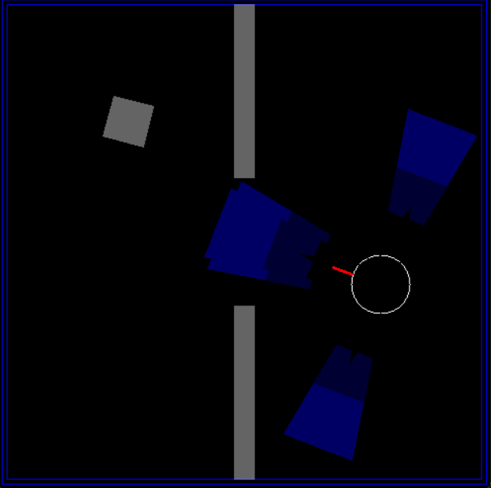

# CS780 Capstone Project: OBELIX Warehouse Robot (DDQN Policy)

[](OBELIX.png)
*The figure shows the OBELIX robot examining a box, taken from the paper ["Automatic Programming of Behaviour-based Robots using Reinforcement Learning"](https://cdn.aaai.org/AAAI/1991/AAAI91-120.pdf).*


## About The Project
This repository contains the final capstone project for the **CS780 Deep Reinforcement Learning** course at IIT Kanpur. The objective is to train an autonomous agent to navigate a Partially Observable Markov Decision Process (POMDP) environment. Using only a limited 18-bit sensor array, the OBELIX robot must locate a target box, attach to it via infrared, and push it out of the arena while avoiding walls.



*Environment (with wall) showing the sensors and the box needed to be pushed*
---

## Repository Structure
* `training_methods/` - Contains the RL training scripts (e.g., `train_ddqn.py`, PPO, A3C).
* `submission/` - Contains the final test-ready policy scripts (`agent.py`).
* `starter_code/` - Original course baseline files.
* `obelix.py` - Core environment logic and physics simulator (OpenCV-based).
* `evaluate.py` / `evaluation_video.py` - Scripts for running local testing and generating video renders.
* `CS780 Capstone Project Details.pdf` - Details of the environment and all the project information.
* `CS780-OBELIX-Aviral-Gupta-230246-report` - Project Report containing all the implementation details.

---

## Getting Started

### Prerequisites
The environment is written in Python 3.7+ and uses OpenCV for GUI rendering. Install dependencies using:
```bash
pip install -r requirements.txt
````

### Manual Gameplay

You can play the game manually to understand the environment, physics, and sensor dynamics by executing:

```bash
python manual_play.py
```

**Controls:**

  * `w`: Move forward
  * `a`: Turn left (45 degrees)
  * `q`: Turn left (22.5 degrees)
  * `e`: Turn right (22.5 degrees)
  * `d`: Turn right (45 degrees)

### Automatic Gameplay & Training

A basic automatic loop can be tested using the environment directly. Below is an example using a hardcoded probabilistic baseline:

```python
import numpy as np
from obelix import OBELIX

bot = OBELIX(scaling_factor=5)
move_choice = ['L45', 'L22', 'FW', 'R22', 'R45']
user_input_choice = [ord("q"), ord("a"), ord("w"), ord("d"), ord("e")]

bot.render_frame()
episode_reward = 0

for step in range(1, 2000):
    random_step = np.random.choice(user_input_choice, 1, p=[0.05, 0.1, 0.7, 0.1, 0.05])[0]
    if random_step in user_input_choice:
        action = move_choice[user_input_choice.index(random_step)]
        sensor_feedback, reward, done = bot.step(action)
        episode_reward += reward
        print(f"Step: {step} | Sensors: {sensor_feedback} | Total Reward: {episode_reward}")
        if done:
            break
```

-----

## Algorithmic Approaches & The "Spin Cycle"

A major challenge in this environment is **sensor aliasing** combined with harsh wall penalties. Because empty space looks identical to being safely far from a wall, early models quickly learned to exploit the environment by entering a permanent **"spin cycle"**—rotating endlessly in place to gain safe, tiny sensor rewards rather than risking a massive penalty by moving forward and hitting a wall.

### The Winning Policy: Double DQN (DDQN)

The best-performing model was a custom **Double DQN** architecture. It successfully solved the environment by implementing:

1.  **Probabilistic Action Selection:** Instead of using deterministic `argmax`, the agent sampled actions using a Softmax distribution. This forced the robot to try moving forward even when sensors read zero, successfully breaking the spin cycle.
2.  **High-Capacity Replay Buffer:** Safely stored the extremely rare but massive positive rewards (+500 for finding the box) so the agent could learn from them repeatedly.
3.  **Level 3 Direct Training:** Bypassed standard curriculum learning by training directly on Level 3 (moving box). The moving box naturally intersected with the robot, acting as an "exploration catalyst" to deliver free early rewards.

### Failed Baselines & Alternatives

Several other standard deep RL algorithms were tested, but failed to converge:

  * **Standard DQN:** Overestimated the value of safe actions (turning) and fell permanently into the spin cycle local optimum.
  * **PPO (with LSTM):** Because PPO is on-policy, its short-term buffer quickly filled with negative turning penalties during early exploration. Without a long-term historical buffer, it immediately forgot the rare positive rewards of finding the box.
  * **Asynchronous Advantage Actor-Critic (A3C):** Expected to diversify exploration via parallel workers, but the severe wall penalties were too dominant. All parallel workers independently converged to the safe spin cycle.

-----

## Scoring & Evaluation

The environment supports a simple, reproducible scoring setup:

  * **Success condition:** Once the robot attaches to the box, the episode ends when the **attached box touches the boundary** (terminal bonus).
  * **Evaluation:** Run the agent for a fixed number of steps, repeat for multiple random seeds, and report the mean/std score.

### Running the Evaluation

You can evaluate any custom agent by modifying `agent_template.py` or by pointing the evaluation script to the final models in the `submission/` folder.

Example evaluation run (10 runs, averaged, wall obstacle enabled):

```bash
python evaluate.py --agent_file submission/agent.py --runs 10 --seed 0 --max_steps 1000 --wall_obstacles
```

**Difficulty Knobs:**

  * `--difficulty 0`: Static box
  * `--difficulty 2`: Blinking / appearing-disappearing box
  * `--difficulty 3`: Moving + blinking box
  * `--box_speed N`: Moving box speed (for `--difficulty >= 3`)
  * `--wall_obstacles`: For enabling the wall for more difficulty

Results are automatically appended to `leaderboard.csv`.

-----

## Video Demonstration
A full video demonstration of the final DDQN agent completing the test phase is available on YouTube.

**[Watch the Final Agent Demonstration on YouTube](https://www.youtube.com/watch?v=WYtdHCqUSno)**

-----

## References & Acknowledgments

  * **Original Paper:** [Automatic Programming of Behaviour-based Robots using Reinforcement Learning](https://www.google.com/url?sa=E&source=gmail&q=https://cdn.aaai.org/AAAI/1991/AAAI91-120.pdf)
  * **Base Simulator:** Codebase adapted from [iabhinavjoshi/OBELIX](https://www.google.com/search?q=https://github.com/iabhinavjoshi/OBELIX)

```
